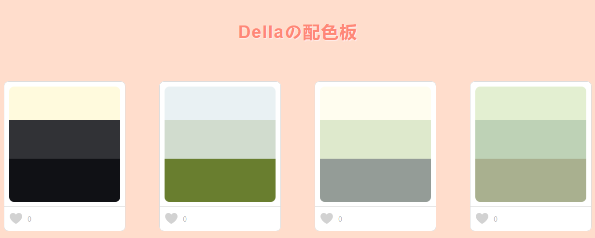

基于组件开发的思想和sass+JavaScript编写的一个收集配色方案的工具。
===========================================

由于没有涉及到后端和数据库，点赞功能只能在当前页面有效，刷新页面点赞记录消失。使用时需配置配色方案的个数、色数和色值。页面demo：

------------------------------------------

灵感来源于自己做简历是过于纠结配色，所以决定将平时浏览网页的时候看到好的配色方案就记录下来，到下次需要的时候可做参考。页面的形式参考[Color Hunt](http://www.colorhunt.co/)。